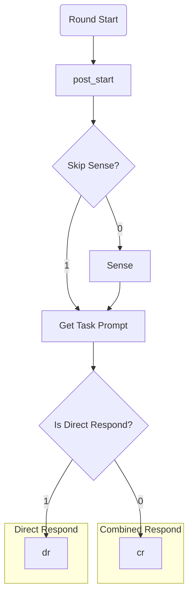

# Dify App Kaye Chat Documentation

## Round Flow Logic

#### skip sense logic

Behavior of whether **Skip Sense** and content of prompt for **Sense** are determined by:

- whether *provided* difficulty (`difficulty_override` >0) or *default* (not provided, `difficulty_override` =0.)
- **roles** provided by `role_override`

|           | provided          | default                       |
|-----------|-------------------|-------------------------------|
| static difficulty roles | skip sense | skip sense             |
| `coder`   | skip sense        | sense for coder difficulty    |
| others    | skip sense        | sense for difficulty          |
| default   | sense for role    | sense for role & difficulty   |

