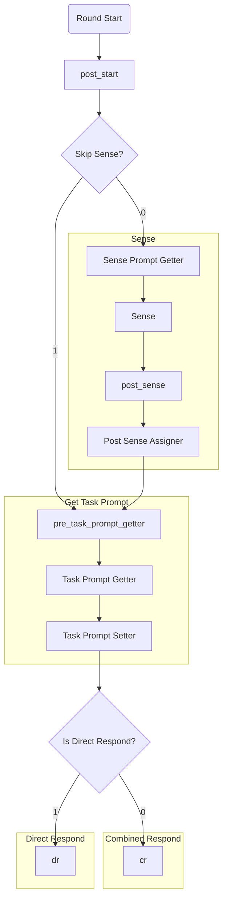

# Dify App Kaye Chat Documentation

based on provided difficulty (`difficulty_override` >0) or default/not provided difficulty (`difficulty_override` =0.)

|           | provided          | default                       |
|-----------|-------------------|-------------------------------|
| static difficulty roles | skip sense | skip sense             |
| `coder`   | skip sense        | sense difficulty for coder    |
| others    | skip sense        | sense for difficulty          |
| default   | sense for role    | sense for role & difficulty   |

