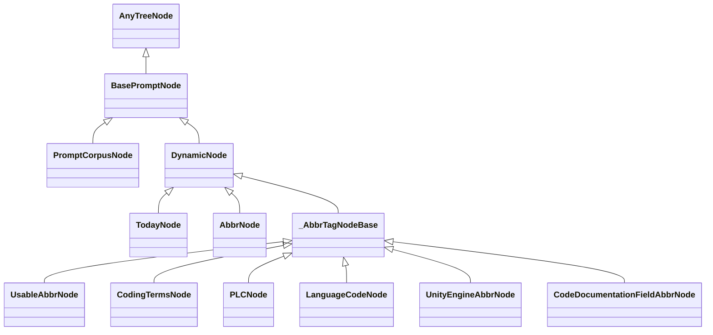

# Kaye Engine Programmatic API documentation

## `prompt` module

The public programmatic API lives in `kaye_engine.prompt`.
It re-exports the prompt tree nodes, blueprint type, corpus loader,
and the blueprint registry.

Example imports:

```python
from kaye_engine.prompt import (
    BasePromptNode,
    DynamicNode,
    PromptCorpusNode,
    PromptBlueprint,
    load_corpus_tree,
    get_corpus_tree,
    BlueprintRegistry,
    register_blueprint,
    get_blueprint,
    blueprint_registry,
)
```


### Prompt Tree Nodes `BasePromptNode`

The **prompt tree** is the structured representation parsed from *prompt corpus text* — see [`corpus-doc.md`](corpus-doc.md) for the format specification. Each section heading in the corpus becomes a node; the text between headings is that node's content.

A *node* in prompt tree is an instance of abstract class ``BasePromptNode``, which is a subclass of `anytree.Node`, q.v. [anytree Documentation](https://anytree.readthedocs.io/en/stable/)

nodes types:

- Prompt Corpus Node `PromptCorpusNode`
- dynamic nodes `DynamicNode`; q.v. [`Dynamic Node Documentation`](dynamic-node-doc.md) for the full type list and details


##### name

Each node has `.name`, i.e. **section heading** which appears in *preview tree* (v.i.):

  - for `DynamicNode` instances: it must be enclosed by `()`.
  - for **sidecar nodes**: it must be enclosed by `{}`.

E.g.

```python
>>> corpus_node.name
"Introduction"
>>> dynamic_node.name
"(Abbreviations)"
```

> [!NOTE]
> `.name` is a property of `anytree.Node`

**Sidecar nodes** are identified by names in curly braces, e.g. `{description}`. They are metadata or conditional instructions attached to parent nodes. For identification, checkmarking, rendering, and complete details, see [`sidecar-node-doc.md`](sidecar-node-doc.md).

**Dynamic nodes** are identified by names in parentheses, such as `(Today)`, `(Abbreviations)`. Unlike sidecar nodes, dynamic nodes are injected at render time and **are** included in the rendered prompt output. Q.v. [`Dynamic Node Documentation`](dynamic-node-doc.md) for comprehensive documentation on dynamic nodes.


##### lineage

Use `.generate_lineage()` to get a linage from root (exclusively) to current node (inclusively,) represented as a ``list`` of node's ``.name``.

> [!TIP]
> Since root is excluded from lineage, tree with different root nodes' names may produce identical lineage.

----

Use `str()` to produce a node's representation that contains the lineage.

E.g.

```python
>>> str(root)
"PromptCorpusNode()"
>>> str(corpus_node)
"PromptCorpusNode(Introduction#Data#Advanced)"
>>> str(abbr_node)
"AbbrNode(Introduction#Data#(Abbreviations))"
```

----

`hash()` of a `BasePromptNode` is also based on `.generate_lineage()`

----

`==` operator of nodes is also based on `.generate_lineage()`.
I.e. `a == b` return whether two nodes has the same lineage.

Additionally, if both nodes are roots, test whether 2 trees are identical in node name structure (node content is irrelevant.)


##### content lines

To access node's textual **content lines**, use `.content_lines()` (typed `list`.)


##### `[]` operator

Use `[]` operator to access child of `node` by:

- index (typed `int`) among all children, or
- child's name (typed `str`)

> [!NOTE]
> When using `str` as key, it will return 1st node that has a name identical to the given value.

> [!TIP]
> Use `.parent` to access node's parent, and `.parent` of a root node is ``None``


##### tree preview

Use `.generate_prompt_tree_preview()` on **root** instance to show a human-readable representation which shows:

- tree structure
- node name, i.e. section heading
- node content preview

E.g.

```python
>>> tree.generate_prompt_tree_preview()
○
└── Project Title
    ├── Description
    │   A brief overview of the project, its purpose, and goals.
    ├── Installation
    │   1. Clone the repo
    │   2. Install dependencies
    │   3. Run the application
    ├── Usage
    │   Provide instructions on how to use the application.
    ├── Contributing
    │   1. Fork the repo
    │   2. Create a new branch
    │   3. Submit a pull request
    └── License
        This project is licensed under the MIT License.
```

As shown above, it contains *content preview*, which can be customized by arguments `content_preview_lines` and `content_preview_width`, e.g.

```python
>>> tree.generate_prompt_tree_preview(content_preview_lines=0)
○
└── Project Title
    ├── Description
    ├── Installation
    ├── Usage
    ├── Contributing
    └── License
```

----

`repr(node)` is equivalent to ``node.generate_prompt_tree_preview()``


##### support `copy`

`BasePromptNode` support Python `copy` operations.

Use `copy.copy(node)` to create a shallow copied identical node, but with no children and no parent (set to `None`)

Use `copy.deepcopy(root)` to copy a prompt tree.


#### tree creation

It is rare for end users to create individual instances, but to **create**
an entire prompt tree, use `load_corpus_tree(tree_name, file_path)`.
`kaye_engine` bundles no corpus markdown file of its own — the caller
supplies the file and a name to cache it under. It parses the file and
attaches the runtime dynamic nodes once; q.v.
[`Dynamic Node Documentation`](dynamic-node-doc.md#using-a-dynamic-node)
for details:

```python
from kaye_engine.prompt import load_corpus_tree, get_corpus_tree

tree_root = load_corpus_tree("my-tree", "path/to/corpus.md")

# subsequent lookups by the same name return the same cached tree
tree_root is get_corpus_tree("my-tree")  # True
```

`PromptBlueprint`'s `corpus_tree` argument defaults to `None`, which
resolves to whichever tree was registered as default via
`load_corpus_tree(..., is_default_tree=True)`. `kaye_engine` bundles no
corpus of its own, so if no host package has loaded one as default yet,
that resolution raises `ValueError`.


#### class diagram




### Prompt Blueprint `PromptBlueprint`

A **prompt blueprint** represents a configurable subset of *prompt corpus tree*, such that individual node are either **checkmarked** (i.e. enabled, turned on) or **uncheckmarked** (i.e. disabled, turned off.) Then one can generate a prompt as a subset of the tree.

----

User always create a populated `PromptBlueprint` by **parsing** a blueprint text (as positional argument `blueprint_text`) by using *classmethod* `.parse()`, e.g.

```python
prompt_corpus = ~
blueprint_text = ~
blueprint = PromptBlueprint.parse(blueprint_text)
```

By default (`corpus_tree=None`), this parses the blueprint text against whichever corpus tree is registered as the process default, v.s. By providing keyword argument `corpus_tree` (a root node, or a name registered via `load_corpus_tree`) one may parse against a different corpus tree instead — this is often only used for testing purpose.

----

Additionally, one might create full/empty blueprints by *classmethod*:

- ``PromptBlueprint.create_full_blueprint()``, and
- ``PromptBlueprint.create_empty_blueprint()``

These return blueprint objects that contain all nodes of the corpus tree, with all nodes checkmarked or uncheckmarked.

----

`PromptBlueprint` is a data structured based on Python `dict`.

A `PromptBlueprint` has 3 additional attributes:

- `.corpus_tree`: the `corpus_tree` argument it was constructed with — a root node, a registered tree name, or `None`
- `.corpus`: corresponding prompt corpus tree root (typed `BasePromptNode`)
- `.sidecars`: blueprint metadata (description, when_to_use, globs) derived from sidecar nodes; see [`sidecar-node-doc.md`](sidecar-node-doc.md) for details

There is no `.display_name` attribute on the instance itself — a blueprint's display name is a render-time argument to `.generate_prompt()` / `.generate_blueprint()` (v.i.), or lives on its `BlueprintRegistry` entry once registered (v.i., "blueprint registry").

Each entry in `PromptBlueprint` represents a node, with key being node `hash()` (typed `int`,) and value being if the node is *checkmarked*, (typed `bool`.) The *root node* is never included in blueprint, because one will assume root node is always enabled/checkmarked.


#### per node operations

There are 2 types of relationships of a prompt corpus **node** and a **blueprint**:

- if a node is **contained**/included as part of the blueprint
- if a node is **checkmarked**/enabled in the blueprint

| check by node' | contains/inclusion | is checkmarked |
| ---- | ---- | ---- |
| hash | `h in bp`, `h in bp.keys()` | `bp.is_checkmarked(h)`, `bp[h]` |
| object | `node in bp` | `bp.is_checkmarked(node)` |
| name | `name in bp` | `bp.is_checkmarked(name)` |

(`h`: hash value, `node`: node object, `bp`: blueprint)


##### checkmarking & uncheckmarking

One might **checkmark** a node in a blueprint, and such node must be from blueprint's corpus tree:

```python
blueprint.checkmark(node)
blueprint += node  # identical
```

And one might **uncheckmark** a node already in the blueprint:

```python
blueprint.uncheckmark(node)
blueprint -= node  # identical
```

`.checkmark()` and `.uncheckmark()` support keyword argument `recursively=` which allows user to (un)checkmark a node and all of its descendants.

For information on how sidecar nodes interact with recursive checkmarking, see [`sidecar-node-doc.md`](sidecar-node-doc.md#in-prompt-corpus).

----

Both operations allows user to provide node as node object, hash value, name.

E.g.

```python
bp.checkmark(bp.corpus[0][1])
bp.checkmark(node_hash)
bp.uncheckmark("Important Instruction")
bp.uncheckmark("(Abbreviations)")
```

However, when encounter a node findable in corpus tree, but not contained in the blueprint:

- `.checkmark()` will automatically contain the node, and then mark it checkmarked
- `.uncheckmark()` will raise a `ValueError`


#### blueprint-level operations

##### prune

Use `bp.prune()` will create a minimum version that contains only branches with checkmarked nodes.


##### merge

Use `.merge()` function to merge 2 blueprints as the union of checkmarked nodes of 2 blueprints.

Operator `|` perform identical function.

E.g.

```python
bp_left.merge(bp_right)  # or, identically
bp_left | bp_right
```


##### generate prompt

Use `.generate_prompt()` to render the concrete prompt as a single string.
Use `render.render_prompt_lines()` (`kaye_engine.prompt.blueprint.render`) when you
want the rendered prompt as a list of lines instead.

Both support `disable_first_heading=`, `show_comment=`, and
`contains_sidecars=` to conditionally include conditional sidecar nodes during rendering.
For details on sidecar node types and conditional inclusion patterns, see [`sidecar-node-doc.md`](sidecar-node-doc.md#conditional-sidecar-nodes).
Any extra keyword arguments are passed through to node `content_lines()`
implementations, which is how dynamic nodes receive values such as `query=`;
q.v. [`Dynamic Node Documentation`](dynamic-node-doc.md#feeding-render-time-input).

E.g.

```python
>>> from kaye_engine.prompt.blueprint import render
>>> tree = PromptBlueprint.parse(...)
>>> render.render_prompt_lines(tree, disable_first_heading=True)
['Overview of the methodologies used.',
 '### Data Collection',
 'How data was gathered for analysis.',
 '',
 '## Conclusion',
 'Summarizing the findings and implications.']
>>> tree.generate_prompt(show_comment=True)
# Main Title
Overview of the methodologies used.
### Data Collection
How data was gathered for analysis.
## Conclusion
Summarizing the findings and implications.
<!-- blueprint: conversation; Kaye Engine v1.2.3 -->
```


##### generate blueprint text

User may use `.generate_blueprint()` to show a human-readable presentation of `PromptBlueprint`; the tree contains:

- tree structure of corresponding *prompt corpus tree*
- node name, i.e. section heading
- node content preview
- **checkmark status** of the node, shown with either `[x]` or `[ ]` as prefix

By default, this prints a **pruned** tree, showing only branches and nodes
relevant to this blueprint. Use `show_full_tree=True` to show the full prompt
corpus tree.

E.g.

```python
>>> tree = PromptBlueprint.parse(...)
>>> tree.generate_blueprint()
    ○
[x] └── Project Title
[ ]     ├── Description
        │   A brief overview of the project, its purpose, and goals.
[ ]     ├── Installation
        │   1. Clone the repo
        │   2. Install dependencies
        │   3. Run the application
[ ]     ├── Usage
        │   Provide instructions on how to use the application.
[ ]     ├── Contributing
        │   1. Fork the repo
        │   2. Create a new branch
        │   3. Submit a pull request
[x]     └── License
            This project is licensed under the MIT License.
(blueprint: conversation; Kaye Engine v1.2.3)
>>> tree.generate_blueprint(content_preview_lines=0, show_comment=True)
    ○
[x] └── Project Title
[ ]     ├── Description
[ ]     ├── Installation
[ ]     ├── Usage
[ ]     ├── Contributing
[x]     └── License
<!-- blueprint: conversation; Kaye Engine v1.2.3 -->
```

----

`repr(blueprint)` is equivalent to `blueprint.generate_blueprint()`


#### blueprint registry

`register_blueprint(name, ...)` creates a `BlueprintRegistry` and
inserts it into the `blueprint_registry` dictionary — the single source
of truth for a blueprint's identity and export policy. `kaye_engine`
bundles no blueprint registrations of its own; a host package calls
`register_blueprint` for each real blueprint it defines. Keys are
canonical kebab-case names; values are `BlueprintRegistry` entries,
retrievable via `get_blueprint(name)`:

```python
from kaye_engine.prompt import get_blueprint, blueprint_registry

registry = get_blueprint("chat")
blueprint = registry.blueprint          # a PromptBlueprint instance
name = registry.display_name            # e.g. "Chat"
skill_name = registry.skill_name        # kebab-case slug, e.g. "chat"
```

Each `BlueprintRegistry` carries the underlying `PromptBlueprint` as
`.blueprint`, its `.name`/`.display_name`, and the export-policy flags
`skill_exportable`, `continue_exportable`, `always_apply`,
`user_invokable`, and `llm_invokable`. Iterate `blueprint_registry`
directly to enumerate every registered blueprint.

