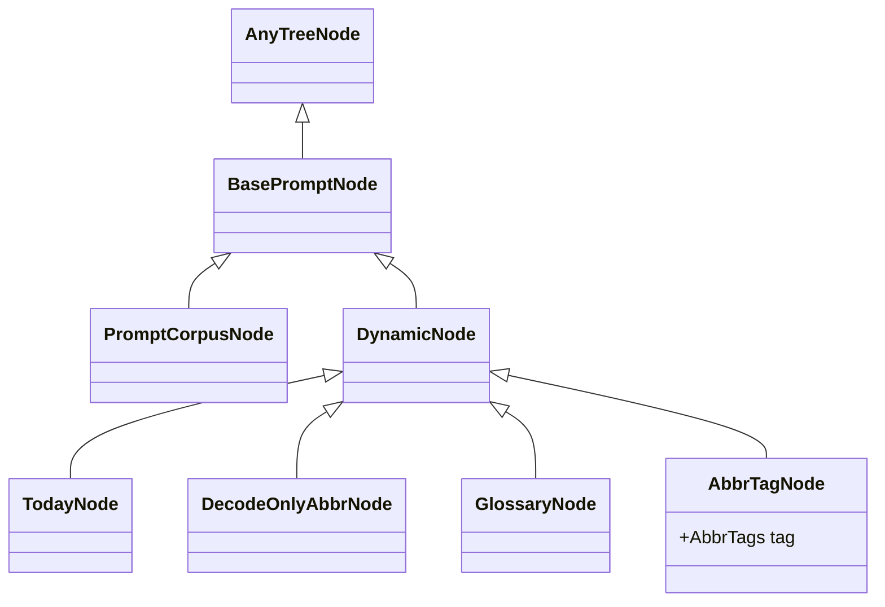

# Kaye Engine: `prompt` module Documentation

The public programmatic API lives in `kaye_engine.prompt`. It re-exports the prompt tree nodes, the blueprint type, the corpus loader, and the blueprint registry.

The page has two halves:

- [Prompt Tree Nodes](#prompt-tree-nodes): the parsed corpus, and how to load it
- [Prompt Blueprint](#prompt-blueprint): which nodes to include, and how to render them

Example imports:

```python
from kaye_engine.prompt import (
    BasePromptNode,
    DynamicNode,
    PromptCorpusNode,
    PromptBlueprint,
    load_corpus_tree,
    get_corpus_tree,
    BlueprintRegistry,
    register_blueprint,
    get_blueprint,
    blueprint_registry,
)
```


## Prompt Tree Nodes

The **prompt tree** is the structured form of the *prompt corpus text*, see [`corpus-doc.md`](corpus-doc.md) for the format. Each section heading in the corpus becomes a node, and the text between headings is that node's content.

A node is an instance of the abstract class `BasePromptNode`, a subclass of `anytree.Node`, see the [anytree Documentation](https://anytree.readthedocs.io/en/stable/).

There are two node types:

- `PromptCorpusNode`: an ordinary corpus section
- `DynamicNode`: a node whose content is generated at render time, see [Dynamic Node Documentation](dynamic-content-doc.md) for the full list of types



### Creating a Tree

Creating individual nodes by hand is rare. To create a whole tree, call `load_corpus_tree(tree_name, sources)`.

`kaye_engine` bundles no corpus file of its own, so the caller supplies:

- `tree_name`: the name to cache the tree under
- `sources`: an ordered list of corpus pieces, where a `str` is literal content and a `Path` is a Markdown file read from disk

The pieces are joined in list order into one document, then parsed, and the runtime dynamic nodes are attached once, see [Dynamic Node Documentation](dynamic-content-doc.md#auto-attachment).

```python
from pathlib import Path

from kaye_engine.prompt import load_corpus_tree, get_corpus_tree

tree_root = load_corpus_tree("my-tree", [Path("path/to/corpus.md")])

# subsequent lookups by the same name return the same cached tree
tree_root is get_corpus_tree("my-tree")  # True
```

`PromptBlueprint`'s `corpus_tree` argument defaults to `None`, which means the tree registered as the default through `load_corpus_tree(..., is_default_tree=True)`. If no consumer package has loaded a default tree yet, that lookup raises `ValueError`.

### Node Basics

#### name

Each node has a `.name`, its **section heading**, which also appears in the [tree preview](#tree-preview):

- a `DynamicNode` name is wrapped in `()`, such as `(decode-only-abbr)`
- a sidecar node name is wrapped in `{}`, such as `{description}`

```python
>>> corpus_node.name
"Introduction"
>>> dynamic_node.name
"(decode-only-abbr)"
```

> [!NOTE]
> `.name` is a property of `anytree.Node`

The two special kinds behave differently at render time:

- **Sidecar nodes** hold metadata or conditional instructions for their parent node, and the plain render skips them. See [`sidecar-node-doc.md`](sidecar-node-doc.md) for identification, checkmarking, and rendering.
- **Dynamic nodes** are injected at render time and **are** part of the rendered output. See [Dynamic Node Documentation](dynamic-content-doc.md).

#### content lines

`.content_lines()` returns a node's text as a `list` of lines.

#### `[]` operator

Use `node[key]` to reach a child by:

- index (`int`) among all children
- name (`str`)

> [!NOTE]
> A `str` key returns the first child with that exact name.

> [!TIP]
> Use `.parent` to reach a node's parent. The `.parent` of a root node is `None`.

### Identity and Comparison

#### lineage

`.generate_lineage()` returns the path from the root (excluded) to the node (included) as a `list` of node names.

> [!TIP]
> The root is excluded, so trees whose roots have different names can produce identical lineages.

Lineage also drives three other behaviors:

- `str(node)` includes the lineage:

  ```python
  >>> str(root)
  "PromptCorpusNode()"
  >>> str(corpus_node)
  "PromptCorpusNode(Introduction#Data#Advanced)"
  >>> str(abbr_node)
  "DecodeOnlyAbbrNode(Introduction#Data#(decode-only-abbr))"
  ```

- `hash(node)` is computed from the lineage
- `a == b` is true when both nodes have the same lineage; when both are roots, it is true when the two trees have identical node-name structure, regardless of content

### tree preview

Call `.generate_prompt_tree_preview()` on a **root** to see a readable view of:

- the tree structure
- each node's name (its section heading)
- a preview of each node's content

```python
>>> tree.generate_prompt_tree_preview()
○
└── Project Title
    ├── Description
    │   A brief overview of the project, its purpose, and goals.
    ├── Installation
    │   1. Clone the repo
    │   2. Install dependencies
    │   3. Run the application
    ├── Usage
    │   Provide instructions on how to use the application.
    ├── Contributing
    │   1. Fork the repo
    │   2. Create a new branch
    │   3. Submit a pull request
    └── License
        This project is licensed under the MIT License.
```

The content preview can be tuned with `content_preview_lines` and `content_preview_width`:

```python
>>> tree.generate_prompt_tree_preview(content_preview_lines=0)
○
└── Project Title
    ├── Description
    ├── Installation
    ├── Usage
    ├── Contributing
    └── License
```

`repr(node)` is the same as `node.generate_prompt_tree_preview()`.

### Copying

`BasePromptNode` supports Python's `copy` module:

- `copy.copy(node)` makes a shallow copy with no children and no parent (`None`)
- `copy.deepcopy(root)` copies a whole prompt tree


## Prompt Blueprint

A **prompt blueprint** is a configurable subset of a prompt corpus tree. Each node is either **checkmarked** (enabled) or **uncheckmarked** (disabled), and a prompt is generated from the checkmarked part of the tree.

### Creating a Blueprint

Parse a blueprint text with the classmethod `.parse()`:

```python
prompt_corpus = ~
blueprint_text = ~
blueprint = PromptBlueprint.parse(blueprint_text)
```

By default (`corpus_tree=None`) the text is parsed against the process default corpus tree, see [Creating a Tree](#creating-a-tree). Pass `corpus_tree` (a root node, or a name registered through `load_corpus_tree`) to parse against another tree instead, which is mostly useful in tests.

Two more classmethods build a blueprint that holds every node of the corpus tree:

- `PromptBlueprint.create_full_blueprint()`: every node checkmarked
- `PromptBlueprint.create_empty_blueprint()`: every node uncheckmarked

### Structure

A `PromptBlueprint` is a data structure based on a Python `dict`. Each entry stands for one node: the key is the node's `hash()` (`int`) and the value says whether it is checkmarked (`bool`). The root node is never stored, because it is always treated as enabled.

A blueprint also has four attributes:

| Attribute | Meaning |
| --- | --- |
| `.corpus_tree` | the `corpus_tree` argument it was built with: a root node, a registered tree name, or `None` |
| `.corpus` | the corpus tree root it resolved to (`BasePromptNode`) |
| `.sidecars` | metadata (description, when_to_use, globs) derived from sidecar nodes, see [`sidecar-node-doc.md`](sidecar-node-doc.md) |
| `.dependencies` | other blueprints this one depends on (`list[PromptBlueprint]`, empty by default), see [Dependencies](#dependencies) |

There is no `.display_name` on the instance. A display name is either a render-time argument of `.generate_prompt_without_dependencies()` and `.generate_blueprint_without_dependencies()`, or it lives on the blueprint's `BlueprintRegistry` entry, see [Blueprint Registry](#blueprint-registry).

#### Dependencies

`.dependencies` holds the blueprints this one directly depends on. `.render_prompt()` and `.render_blueprint()` resolve them recursively and merge them as a union of checkmarks.

The constructor's `dependencies` argument also accepts `str` entries (`list[PromptBlueprint | str]`). Each `str` is resolved when the blueprint is constructed, to the blueprint registered under that name through `register_blueprint()`.

### Per-Node Operations

A node and a blueprint can be related in two ways:

- the node is **contained** in the blueprint
- the node is **checkmarked** in the blueprint

| Look up by | Contained | Checkmarked |
| --- | --- | --- |
| hash | `h in bp`, `h in bp.keys()` | `bp.is_checkmarked(h)`, `bp[h]` |
| object | `node in bp` | `bp.is_checkmarked(node)` |
| name | `name in bp` | `bp.is_checkmarked(name)` |

(`h`: hash value, `node`: node object, `bp`: blueprint)

#### Checkmarking and Unchecking

A node to checkmark must come from the blueprint's corpus tree:

```python
blueprint.checkmark(node)
blueprint += node  # identical
```

A node already in the blueprint can be unchecked:

```python
blueprint.uncheckmark(node)
blueprint -= node  # identical
```

Both calls take a node object, a hash value, or a name:

```python
bp.checkmark(bp.corpus[0][1])
bp.checkmark(node_hash)
bp.uncheckmark("Important Instruction")
bp.uncheckmark("(decode-only-abbr)")
```

Pass `recursively=True` to change a node and all its descendants at once. For how sidecar nodes behave under recursive checkmarking, see [`sidecar-node-doc.md`](sidecar-node-doc.md#in-prompt-corpus).

When a node exists in the corpus tree but is not yet contained in the blueprint:

- `.checkmark()` adds the node, then checkmarks it
- `.uncheckmark()` raises `ValueError`

### Blueprint-Level Operations

#### prune

`bp.prune()` returns a minimal blueprint that keeps only the branches containing checkmarked nodes.

#### merge

`.merge()` combines two blueprints into the union of their checkmarked nodes. The `|` operator does the same:

```python
bp_left.merge(bp_right)  # or, identically
bp_left | bp_right
```

### Generating a Prompt

Two methods render the concrete prompt, which is the text used as an LLM system message:

- `.render_prompt()`: renders this blueprint merged with its whole chain of `.dependencies`
- `.generate_prompt_without_dependencies()`: renders only this blueprint's own checkmarks and ignores `.dependencies`

Anything that renders *final*, LLM-facing content should call `.render_prompt()`.

To get the prompt as a list of lines instead of one string, use `render.render_prompt_lines()` from `kaye_engine.prompt.blueprint.render`.

All of them take:

- `profile=`: a `RenderProfile` carrying every render setting, see [`render-profile-doc.md`](render-profile-doc.md) for its fields, merging, render modes, and CLI options
- extra keyword arguments: passed on to each node's `content_lines()`, which is how dynamic nodes receive values such as `query=`, see [Dynamic Node Documentation](dynamic-content-doc.md#feeding-render-time-input)

```python
>>> from kaye_engine.prompt.blueprint import render
>>> from kaye_engine.prompt.blueprint.render_profile import RenderProfile
>>> tree = PromptBlueprint.parse(...)
>>> render.render_prompt_lines(
...     tree, profile=RenderProfile(disable_first_heading=True)
... )
['Overview of the methodologies used.',
 '### Data Collection',
 'How data was gathered for analysis.',
 '',
 '## Conclusion',
 'Summarizing the findings and implications.']
>>> tree.generate_prompt_without_dependencies(
...     profile=RenderProfile(show_comment=True)
... )
# Main Title
Overview of the methodologies used.
### Data Collection
How data was gathered for analysis.
## Conclusion
Summarizing the findings and implications.
<!-- blueprint: conversation; Kaye Engine v1.2.3 -->
```

#### How Dependencies Are Resolved

`.render_prompt()` first resolves `.dependencies` recursively and unions them in with `.merge()`, so a diamond dependency converges without duplicating shared content. It then calls `.generate_prompt_without_dependencies()` on the merged result. A dependency cycle raises `ValueError`.

### generate negative prompt

The negative prompt is not a separate method. It is the same `.render_prompt()` and `.generate_prompt_without_dependencies()` entry point, switched by the profile's `mode`:

```python
RenderProfile(mode=RenderMode.NEGATIVE)
```

In this mode, the output is built from `{avoid}` sidecars:

- a node's own `{avoid}` child prints under that node's heading, and only when the node is checkmarked; the literal `{avoid}` heading is never shown
- descendants are always walked, so a checkmarked node below an unchecked ancestor still contributes, and the ancestor's heading is printed only for context
- a node with no `{avoid}` child and no contributing descendant is left out

See [`sidecar-node-doc.md`](sidecar-node-doc.md#negative-instruction-sidecar) for how `{avoid}` differs from a descriptor or conditional sidecar.

Given a checkmarked tree shaped like this:

```
## Some
### Prompt
#### {avoid}
Don't do this.
#### Content
##### {avoid}
Or this.
```

the negative render is:

```python
>>> render.render_negative_prompt_lines(tree)
['## Some',
 '### Prompt',
 "Don't do this.",
 '',
 '#### Content',
 'Or this.']
```

`render.render_negative_prompt_lines()` is the function `render_prompt_lines()` hands off to when `RenderMode.NEGATIVE` is set. Call it directly to get the same output without a `PromptBlueprint`. Dependency resolution through `.render_prompt(profile=...)` works the same in every mode.

The other `RenderMode` members (`POST_ORDER`, `REVERSE_ORDER`, `IMAGE`), and how they combine with `NEGATIVE`, are covered in [`render-profile-doc.md`](render-profile-doc.md#render-modes).

### generate blueprint text

`.generate_blueprint_without_dependencies()` shows a readable preview of the blueprint's own content only, ignoring `.dependencies`. The preview contains:

- the tree structure of the corresponding prompt corpus tree
- each node's name (its section heading)
- a preview of each node's content
- the **checkmark status** of each node, as a `[x]` or `[ ]` prefix

By default the tree is **pruned** to the branches relevant to this blueprint. Pass `show_full_tree=True` to show the whole corpus tree.

```python
>>> tree = PromptBlueprint.parse(...)
>>> tree.generate_blueprint_without_dependencies()
    ○
[x] └── Project Title
[ ]     ├── Description
        │   A brief overview of the project, its purpose, and goals.
[ ]     ├── Installation
        │   1. Clone the repo
        │   2. Install dependencies
        │   3. Run the application
[ ]     ├── Usage
        │   Provide instructions on how to use the application.
[ ]     ├── Contributing
        │   1. Fork the repo
        │   2. Create a new branch
        │   3. Submit a pull request
[x]     └── License
            This project is licensed under the MIT License.
(blueprint: conversation; Kaye Engine v1.2.3)
>>> tree.generate_blueprint_without_dependencies(content_preview_lines=0, show_comment=True)
    ○
[x] └── Project Title
[ ]     ├── Description
[ ]     ├── Installation
[ ]     ├── Usage
[ ]     ├── Contributing
[x]     └── License
<!-- blueprint: conversation; Kaye Engine v1.2.3 -->
```

`.render_blueprint()` gives the same preview for this blueprint merged with its whole chain of `.dependencies`, resolved the same way as `.render_prompt()`.

`repr(blueprint)` is the same as `blueprint.generate_blueprint_without_dependencies()`.

### Blueprint Registry

`register_blueprint(name, ...)` creates a `BlueprintRegistry` and inserts it into the `blueprint_registry` dictionary, the single source of truth for a blueprint's identity and export policy.

`kaye_engine` bundles no blueprint registrations of its own. A consumer package calls `register_blueprint` for each real blueprint it defines. Keys are canonical kebab-case names, values are `BlueprintRegistry` entries, and `get_blueprint(name)` retrieves one:

```python
from kaye_engine.prompt import get_blueprint, blueprint_registry

registry = get_blueprint("chat")
blueprint = registry.blueprint          # a PromptBlueprint instance
name = registry.display_name            # e.g. "Chat"
canonical_name = registry.canonical_name  # kebab-case slug, e.g. "chat"
```

Each entry carries:

- `.blueprint`: the underlying `PromptBlueprint`
- `.canonical_name` and `.display_name`
- `.is_exportable`: whether it is exported as an Agent Skill
- `is_user_invokable` and `llm_invokable`: the export-policy flags

Iterate `blueprint_registry` directly to list every registered blueprint.
