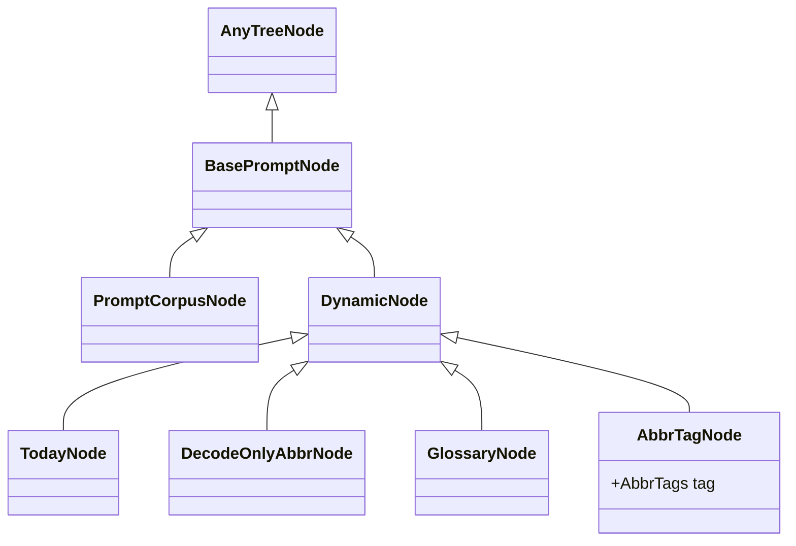

# Kaye Engine: `prompt` module Documentation

<!-- FIXME mpv prompt module doc -->

The public programmatic API lives in `kaye_engine.prompt`. It re-exports the prompt tree nodes, the `Blueprint` value and its functions, the corpus loader, and the blueprint registry.

The page has two halves:

- [Prompt Tree Nodes](#prompt-tree-nodes): the parsed corpus, and how to load it
- [Prompt Blueprint](#prompt-blueprint): which nodes to include, and how to render them

Example imports:

```python
from kaye_engine.prompt import (
    BasePromptNode,
    DynamicNode,
    PromptCorpusNode,
    Blueprint,
    create_blueprint,
    checkmark_nodes,
    parse_blueprint_tree,
    render_prompt,
    load_corpus_tree,
    get_corpus_tree,
    clear_corpus_tree,
    BlueprintRegistry,
    register_blueprint,
    get_blueprint,
    blueprint_registry,
)
```


## Prompt Tree Nodes

The **prompt tree** is the structured form of the *prompt corpus text*, see [`corpus-doc.md`](corpus-doc.md) for the format. Each section heading in the corpus becomes a node, and the text between headings is that node's content.

A node is an instance of the abstract class `BasePromptNode`, a subclass of `anytree.Node`, see the [anytree Documentation](https://anytree.readthedocs.io/en/stable/).

There are two node types:

- `PromptCorpusNode`: an ordinary corpus section
- `DynamicNode`: a node whose content is generated at render time, see [Dynamic Node Documentation](dynamic-content-doc.md) for the full list of types



### Creating a Tree

Creating individual nodes by hand is rare. To create the whole tree, call `load_corpus_tree(sources)`.

`kaye_engine` bundles no corpus file of its own, so the caller supplies `sources`: an ordered list of corpus pieces, where a `str` is literal content and a `Path` is a Markdown file read from disk.

The pieces are joined in list order into one document, then parsed, and the runtime dynamic nodes are attached once, see [Dynamic Node Documentation](dynamic-content-doc.md#auto-attachment).

```python
from pathlib import Path

from kaye_engine.prompt import load_corpus_tree, get_corpus_tree

tree_root = load_corpus_tree([Path("path/to/corpus.md")])

tree_root is get_corpus_tree()  # True
```

A process holds **one** corpus tree:

| Call | Result |
| --- | --- |
| `load_corpus_tree(sources)` | loads the tree; raises `ValueError` when one is already loaded |
| `get_corpus_tree()` | returns the loaded root; raises `ValueError` before any load |
| `clear_corpus_tree()` | drops the tree and everything derived from it, so `load_corpus_tree()` may run again; a no-op when none is loaded |

Every blueprint function reads this one tree. There is no tree argument, no tree name, and no default-tree flag.

### Node Basics

#### name

Each node has a `.name`, its **section heading**, which also appears in the [tree preview](#tree-preview):

- a `DynamicNode` name is wrapped in `()`, such as `(decode-only-abbr)`
- a sidecar node name is wrapped in `{}`, such as `{description}`

```python
>>> corpus_node.name
"Introduction"
>>> dynamic_node.name
"(decode-only-abbr)"
```

> [!NOTE]
> `.name` is a property of `anytree.Node`

The two special kinds behave differently at render time:

- **Sidecar nodes** hold metadata or conditional instructions for their parent node, and the plain render skips them. See [`sidecar-node-doc.md`](sidecar-node-doc.md) for identification, checkmarking, and rendering.
- **Dynamic nodes** are injected at render time and **are** part of the rendered output. See [Dynamic Node Documentation](dynamic-content-doc.md).

#### content lines

`.content_lines()` returns a node's text as a `list` of lines.

#### `[]` operator

Use `node[key]` to reach a child by:

- index (`int`) among all children
- name (`str`)

> [!NOTE]
> A `str` key returns the first child with that exact name.

> [!TIP]
> Use `.parent` to reach a node's parent. The `.parent` of a root node is `None`.

### Identity and Comparison

#### lineage

`.generate_lineage()` returns the path from the root (excluded) to the node (included) as a `list` of node names.

> [!TIP]
> The root is excluded, so trees whose roots have different names can produce identical lineages.

Lineage also drives three other behaviors:

- `str(node)` includes the lineage:

  ```python
  >>> str(root)
  "PromptCorpusNode()"
  >>> str(corpus_node)
  "PromptCorpusNode(Introduction#Data#Advanced)"
  >>> str(abbr_node)
  "DecodeOnlyAbbrNode(Introduction#Data#(decode-only-abbr))"
  ```

- `hash(node)` is computed from the lineage
- `a == b` is true when both nodes have the same lineage; when both are roots, it is true when the two trees have identical node-name structure, regardless of content

### tree preview

Call `.generate_prompt_tree_preview()` on a **root** to see a readable view of:

- the tree structure
- each node's name (its section heading)
- a preview of each node's content

```python
>>> tree.generate_prompt_tree_preview()
○
└── Project Title
    ├── Description
    │   A brief overview of the project, its purpose, and goals.
    ├── Installation
    │   1. Clone the repo
    │   2. Install dependencies
    │   3. Run the application
    ├── Usage
    │   Provide instructions on how to use the application.
    ├── Contributing
    │   1. Fork the repo
    │   2. Create a new branch
    │   3. Submit a pull request
    └── License
        This project is licensed under the MIT License.
```

The content preview can be tuned with `content_preview_lines` and `content_preview_width`:

```python
>>> tree.generate_prompt_tree_preview(content_preview_lines=0)
○
└── Project Title
    ├── Description
    ├── Installation
    ├── Usage
    ├── Contributing
    └── License
```

`repr(node)` is the same as `node.generate_prompt_tree_preview()`.

### Copying

`BasePromptNode` supports Python's `copy` module:

- `copy.copy(node)` makes a shallow copy with no children and no parent (`None`)
- `copy.deepcopy(root)` copies a whole prompt tree


## Prompt Blueprint

A **blueprint** is a configurable subset of the prompt corpus tree. A `Blueprint` is a frozen, plain value: it records *which* nodes are checkmarked by their **paths**, and never holds a node object. A prompt is generated from the checkmarked part of the loaded corpus.

Because a blueprint is pure data, it is hashable, picklable, comparable by value, and can be built before any corpus is loaded. Only the functions that look nodes up (checkmarking, binding, rendering) need the corpus.

### Structure

A `Blueprint` has four fields:

| Field | Meaning |
| --- | --- |
| `.nodes` | `frozenset[NodePath]`: nodes checkmarked one by one |
| `.subtrees` | `frozenset[NodePath]`: nodes checkmarked together with every non-sidecar descendant, even one added later |
| `.dependencies` | `tuple[str or Blueprint, ...]`: a `str` names a registered blueprint, resolved at render time; a `Blueprint` is carried as a value |
| `.meta` | `BlueprintMeta`: the display name and descriptors for the exporters, see [`sidecar-node-doc.md`](sidecar-node-doc.md#blueprintmeta) |

A `NodePath` is a tuple of section names from just below the root down to the node, such as `("Style Guide", "Good Writing")`. The root itself is never stored, because it is always enabled.

A display name is blueprint meta: `bp.meta.display_name`, `""` when unnamed. A `BlueprintRegistry` entry reads it live, see [Blueprint Registry](#blueprint-registry); it is also a render-time argument.

### Creating a Blueprint

```python
from kaye_engine.prompt import (
    create_blueprint,
    create_blueprint_from_node,
    parse_blueprint_tree,
)

empty = create_blueprint()
full = create_blueprint(is_full=True)  # one subtrees entry for the root
one = create_blueprint_from_node("Introduction", is_recursive=True)
parsed = parse_blueprint_tree(blueprint_text)
```

`parse_blueprint_tree()` reads the format `preview_selection()` prints: only the lines marked `[x]` select a node, and unchecked lines are ignored. While a corpus is loaded, every heading is checked against it, and an unknown heading raises `ValueError`.

`create_blueprint_from_node()` names the blueprint after the node and points `.meta` at the node's own `{description}`, `{when_to_use}` and `{globs}` sidecar children, where it has them. Pass `meta=` to take over the whole meta, name included.

### Editing a Blueprint

Every edit function returns a **new** blueprint and never mutates its argument. A node argument is a node object of the loaded corpus, a name (the first match in pre-order), or a `NodePath`; an unknown node raises `ValueError`, and a hash integer is no longer accepted.

```python
from kaye_engine.prompt import (
    checkmark_nodes,
    uncheckmark_nodes,
    is_checkmarked,
    merge_blueprints,
    replace_meta,
)

bp = checkmark_nodes(bp, ("Style Guide",))
bp = checkmark_nodes(bp, "Assistant Barista", is_recursive=True)
bp = uncheckmark_nodes(bp, "Important Instruction")
is_checkmarked(bp, "(decode-only-abbr)")  # False
bp = replace_meta(bp, description="quick, mechanical text tasks")
merged = merge_blueprints(bp_left, bp_right)
```

- `is_recursive=True` on `checkmark_nodes()` records a `subtrees` entry, so the node and all its non-sidecar descendants are selected. Sidecar nodes are only ever checkmarked by name, never through a subtree
- `uncheckmark_nodes()` on a node covered by a subtree first expands the subtree into explicit nodes, so only that node is removed. Unchecking a node that is not checkmarked changes nothing
- `merge_blueprints(left, right)` is the union of both selections; `left` wins every meta field it sets, and dependencies keep `left`'s order, then `right`'s not already present

#### Dependencies

`.dependencies` holds the blueprints this one depends on. `render_prompt()` and `preview_blueprint()` resolve them recursively and merge them as a union of checkmarks.

A `str` entry is looked up in the registry **at render time**, so a dependency registered after its dependent still resolves. `register_blueprint()` validates every dependency name at registration.

### JSON and Pickle

A blueprint round-trips through JSON with a schema number on the envelope, with no corpus loaded:

```python
from kaye_engine.prompt import (
    encode_blueprint,
    decode_blueprint,
    dump_blueprint,
    parse_blueprint_json,
    save_blueprint,
    load_blueprint,
)

data = encode_blueprint(bp)         # JSON-ready dict, paths sorted
bp2 = decode_blueprint(data)        # dict only
text = dump_blueprint(bp, indent=2) # JSON text
bp3 = parse_blueprint_json(text)    # JSON text only
save_blueprint(bp, "bp.json")
bp4 = load_blueprint("bp.json")
assert bp == bp2 == bp3 == bp4
```

Each function takes one input type: `decode_blueprint()` a dict, `parse_blueprint_json()` JSON text, `parse_blueprint_tree()` preview-tree text, `load_blueprint()` a file path. None of them detects a format; the CLI does that. `decode_blueprint()` and `parse_blueprint_json()` raise `ValueError` on malformed JSON, an unknown schema number, or a malformed field. A hand-written JSON file decodes the same way. A pickled blueprint equals the original in a fresh process, whatever `PYTHONHASHSEED` is.

### Inspecting a Blueprint

Pure functions of a blueprint (or two), none of which mutates it:

- `validate_blueprint(bp)`: returns `bp` itself, or raises `ValueError` for an unregistered dependency name or, while a corpus is loaded, a path it does not contain. `register_blueprint()` calls it
- `resolve_dependencies(bp)`: the direct dependencies as `Blueprint` values, names looked up in the registry now
- `trace_dependencies(bp)`: the whole transitive closure as values, each after its own dependencies and once only; a cycle or an unknown name raises `ValueError`
- `diff_blueprints(left, right)`: a `BlueprintDiff` of the `nodes` only `left` holds and only `right` holds
- `show_blueprint(bp)`: a `BlueprintSummary` of the meta, node and subtree counts, and dependency names
- `show_dependencies(bp)`: the dependency names in order; a dependency carried as a value shows as `<blueprint value>`
- `show_description(bp)`, `show_when_to_use(bp)`, `show_description_and_when_to_use(bp)`, `show_globs(bp)`: the descriptor fields, see [`sidecar-node-doc.md`](sidecar-node-doc.md)

### The Corpus Index and Selection

The engine derives a `CorpusIndex` once per process from the loaded tree: pre-order node arrays, paths, depths, parent and child indexes, subtree masks, sidecar masks, and the static content block of each node. `get_corpus_index()` returns it, and `clear_corpus_tree()` drops it.

`bind_selection(blueprint)` turns a blueprint into a `BlueprintSelection`: one bitmask over the index (memoized per blueprint). `resolve_selection(blueprint)` additionally ORs in the dependencies by name, with a cycle guard. Both are what the renderers use; most code never calls them.

`get_corpus_node(*path)` returns the node object at a path, and raises `ValueError` naming an unknown one.

### Generating a Prompt

Two functions render the concrete prompt, which is the text used as an LLM system message:

- `render_prompt(blueprint)`: renders this blueprint merged with its whole chain of `.dependencies`
- `render_prompt_without_dependencies(blueprint)`: renders only this blueprint's own checkmarks and ignores `.dependencies`

Anything that renders *final*, LLM-facing content should call `render_prompt()`.

To get the prompt as a list of lines instead of one string, use `render_prompt_lines()` from `kaye_engine.prompt.blueprint.render`, which takes a `BlueprintSelection`.

All of them take:

- `profile=`: a `RenderProfile` carrying every render setting, see [`render-profile-doc.md`](render-profile-doc.md) for its fields, merging, render modes, and CLI options
- extra keyword arguments: passed on to each node's `content_lines()`, which is how dynamic nodes receive values such as `query=`, see [Dynamic Node Documentation](dynamic-content-doc.md#feeding-render-time-input)

```python
>>> from kaye_engine.prompt import parse_blueprint_tree, render_prompt_without_dependencies
>>> from kaye_engine.prompt.blueprint import bind_selection, render
>>> from kaye_engine.prompt.blueprint.render_profile import RenderProfile
>>> bp = parse_blueprint_tree(...)
>>> render.render_prompt_lines(
...     bind_selection(bp), profile=RenderProfile(disable_first_heading=True)
... )
['Overview of the methodologies used.',
 '### Data Collection',
 'How data was gathered for analysis.',
 '',
 '## Conclusion',
 'Summarizing the findings and implications.']
>>> render_prompt_without_dependencies(
...     bp, profile=RenderProfile(show_comment=True)
... )
# Main Title
Overview of the methodologies used.
### Data Collection
How data was gathered for analysis.
## Conclusion
Summarizing the findings and implications.
<!-- blueprint: conversation; Kaye Engine v1.2.3 -->
```

#### How Dependencies Are Resolved

`render_prompt()` first resolves `.dependencies` recursively and unions their selections in, so a diamond dependency converges without duplicating shared content. It then splices conditional sidecars and renders the merged selection. A dependency cycle, or an unknown dependency name, raises `ValueError`.

### generate negative prompt

The negative prompt is not a separate function. It is the same `render_prompt()` and `render_prompt_without_dependencies()` entry point, switched by the profile's `mode`:

```python
RenderProfile(mode=RenderMode.NEGATIVE)
```

In this mode, the output is built from `{avoid}` sidecars:

- a node's own `{avoid}` child prints under that node's heading, and only when the node is checkmarked; the literal `{avoid}` heading is never shown
- descendants are always walked, so a checkmarked node below an unchecked ancestor still contributes, and the ancestor's heading is printed only for context
- a node with no `{avoid}` child and no contributing descendant is left out

See [`sidecar-node-doc.md`](sidecar-node-doc.md#negative-instruction-sidecar) for how `{avoid}` differs from a descriptor or conditional sidecar.

Given a checkmarked tree shaped like this:

```
## Some
### Prompt
#### {avoid}
Don't do this.
#### Content
##### {avoid}
Or this.
```

the negative render is:

```python
>>> render.render_negative_prompt_lines(bind_selection(bp))
['## Some',
 '### Prompt',
 "Don't do this.",
 '',
 '#### Content',
 'Or this.']
```

`render.render_negative_prompt_lines()` is the function `render_prompt_lines()` hands off to when `RenderMode.NEGATIVE` is set. Call it directly to get the same output without a profile. Dependency resolution through `render_prompt(bp, profile=...)` works the same in every mode.

The other `RenderMode` members (`POST_ORDER`, `REVERSE_ORDER`, `IMAGE`), and how they combine with `NEGATIVE`, are covered in [`render-profile-doc.md`](render-profile-doc.md#render-modes).

### Previewing a Blueprint

`preview_blueprint_without_dependencies(blueprint)` shows a readable preview of the blueprint's own content only, ignoring `.dependencies`. The preview contains:

- the tree structure of the corresponding prompt corpus tree
- each node's name (its section heading)
- a preview of each node's content
- the **checkmark status** of each node, as a `[x]` or `[ ]` prefix

By default the tree shows the selected nodes plus their ancestors. Pass `show_full_tree=True` to show the whole corpus tree.

```python
>>> preview_blueprint_without_dependencies(bp)
    ○
[x] └── Project Title
[ ]     ├── Description
        │   A brief overview of the project, its purpose, and goals.
[ ]     ├── Installation
        │   1. Clone the repo
        │   2. Install dependencies
        │   3. Run the application
[ ]     ├── Usage
        │   Provide instructions on how to use the application.
[ ]     ├── Contributing
        │   1. Fork the repo
        │   2. Create a new branch
        │   3. Submit a pull request
[x]     └── License
            This project is licensed under the MIT License.
(blueprint: conversation; Kaye Engine v1.2.3)
>>> preview_blueprint_without_dependencies(
...     bp, content_preview_lines=0, show_comment=True
... )
    ○
[x] └── Project Title
[ ]     ├── Description
[ ]     ├── Installation
[ ]     ├── Usage
[ ]     ├── Contributing
[x]     └── License
<!-- blueprint: conversation; Kaye Engine v1.2.3 -->
```

`preview_blueprint(blueprint)` gives the same preview for this blueprint merged with its whole chain of `.dependencies`, resolved the same way as `render_prompt()`.

The preview parses back through `parse_blueprint_tree()` to an equal blueprint.

### Blueprint Registry

`register_blueprint(name, blueprint, ...)` creates a `BlueprintRegistry` and inserts it into the `blueprint_registry` dictionary, the single source of truth for a blueprint's identity and export policy.

`kaye_engine` bundles no blueprint registrations of its own. A consumer package calls `register_blueprint` for each real blueprint it defines. Keys are canonical kebab-case names, values are `BlueprintRegistry` entries, and `get_blueprint(name)` retrieves one:

```python
from kaye_engine.prompt import get_blueprint, blueprint_registry

registry = get_blueprint("chat")
blueprint = registry.blueprint          # a Blueprint value
name = registry.display_name            # e.g. "Chat", read from blueprint.meta
canonical_name = registry.canonical_name  # kebab-case slug, e.g. "chat"
```

Each entry carries:

- `.blueprint`: the underlying `Blueprint`; assign a new value to edit it, as a blueprint is immutable
- `.canonical_name` and `.display_name`: the name is read live from `.blueprint.meta.display_name`, so reassigning `.blueprint` with a new meta name changes it; when the meta name is empty it falls back to the optional `display_name=` argument of `register_blueprint()`, else `""`
- `.is_exportable`: whether it is exported as an Agent Skill
- `is_user_invokable` and `llm_invokable`: the export-policy flags

Iterate `blueprint_registry` directly to list every registered blueprint.

### Breaking Changes

| Before | Now |
| --- | --- |
| `PromptBlueprint` (a `dict` subclass) | frozen `Blueprint` value plus pure functions |
| `bp.checkmark(node)`, `bp += node` | `bp = checkmark_nodes(bp, node)` |
| `bp.uncheckmark(node)` | `bp = uncheckmark_nodes(bp, node)` |
| `bp.merge(other)`, `bp \| other` | `merge_blueprints(bp, other)` |
| `bp.prune()` | removed; a blueprint stores only its selection |
| `PromptBlueprint.parse(text, corpus_tree=)` | `parse_blueprint_tree(text)` |
| `create_full_blueprint()`, `create_empty_blueprint()`, `create_from_node()` | `create_blueprint(is_full=)`, `create_blueprint_from_node()` |
| node as hash integer | node object, name, or `NodePath` |
| `bp.render_prompt()`, `bp.generate_prompt_without_dependencies()` | `render_prompt(bp)`, `render_prompt_without_dependencies(bp)` |
| `bp.render_blueprint()`, `bp.generate_blueprint_without_dependencies()` | `preview_blueprint(bp)`, `preview_blueprint_without_dependencies(bp)` |
| `bp.sidecars`, `BlueprintDescriptorSidecars` | `bp.meta`, `BlueprintMeta`, `show_description()` and friends |
| `corpus_tree=` argument | none: one corpus per process |
| `load_corpus_tree(name, sources, is_default_tree=)`, `get_corpus_tree(name)` | `load_corpus_tree(sources)`, `get_corpus_tree()`, `clear_corpus_tree()` |
| `get_default_corpus_tree()` | `get_corpus_tree()` |
| dependency `str` resolved at construction | resolved at render time |
