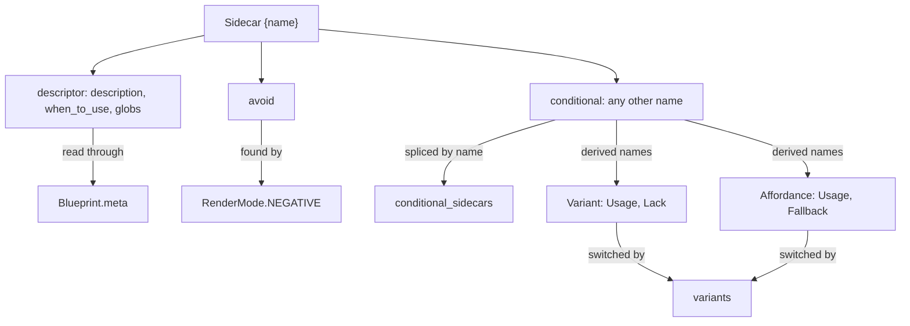

# Kaye Engine: Sidecar, Affordance, Variant Documentation

Three concepts share this page, from general to specific:

- [Sidecar](#sidecar): a corpus node in curly braces, holding metadata or conditional content about its parent
- [Affordance](#affordance): a platform capability family, whose derived sidecars say what to do when it is available or not
- [Variant](#variant): one concrete implementation of an affordance, and the render switch that turns the derived sidecars on




## Sidecar

**Sidecar nodes** are corpus nodes whose heading is wrapped in curly braces, such as `{description}`. They hang under a parent node in the prompt tree and hold metadata or conditional content about that parent. They appear in the blueprint preview tree, but the plain render **skips** them.


### In the Prompt Corpus

Sidecar heading format, identification, reserved names, and checkmarking behavior are documented in the [Sidecar Nodes section of `corpus-doc.md`](corpus-doc.md#sidecar-nodes).


### Descriptor Sidecars

Descriptor sidecars describe a parent node's purpose, relevance, and context. They are never rendered into the prompt. A blueprint reaches them through its `.meta`, a `BlueprintMeta` holding **node paths**, never node objects.


#### BlueprintMeta

`BlueprintMeta` is a frozen, keyword-only dataclass in `kaye_engine.prompt.blueprint.data`:

| Field | Type | Meaning |
| --- | --- | --- |
| `display_name` | `str` | the human-facing name, `""` when unnamed |
| `description` | `str or None` | a literal description that takes priority over the node |
| `description_node` | `NodePath or None` | path of the node holding the description |
| `when_to_use_node` | `NodePath or None` | path of the node holding the when-to-use |
| `globs_node` | `NodePath or None` | path of the node holding the glob patterns |

`create_blueprint_from_node()` fills the three node fields from the node's own `{description}`, `{when_to_use}` and `{globs}` children, where it has them, and defaults `display_name` to the node's name. `replace_meta()` replaces any field, and `merge_blueprints()` lets `left` win every field it sets, see [`prompt-doc.md`](prompt-doc.md#editing-a-blueprint).


#### Reading the Descriptors

The functions below live in `kaye_engine.prompt.blueprint.render` and are re-exported from `kaye_engine.prompt`. All except `show_display_name` need the corpus loaded; a meta path the corpus does not contain raises `ValueError`.

| Function | Returns |
| --- | --- |
| `show_display_name(bp)` | the meta display name, `""` when unnamed; pure data |
| `show_description(bp)` | the literal `description` when set, else the description node's content as one line, else `""` |
| `show_when_to_use(bp)` | the when-to-use node's content as one line, else `""` |
| `show_description_and_when_to_use(bp)` | the literal `description` alone when set, else both nodes' content joined by the replacement newline symbol |
| `show_globs(bp)` | the patterns of the globs node's first fenced `glob` block, one per line, as a `list` |

The three descriptors behave differently:

- `{description}`: **overridable**. The literal `meta.description` wins, otherwise the node at `meta.description_node` supplies it
- `{when_to_use}`: always read from the node, never overridden. It states when the parent is relevant, for filtering nodes in blueprint UIs and documentation
- `{globs}`: needs **fence parsing**. The patterns come from the node's first fenced block marked `glob`, one pattern per line, and editors and IDE integrations use them to decide when to apply the prompt

```python
from kaye_engine.prompt import (
    create_blueprint_from_node,
    replace_meta,
    show_description,
    show_globs,
    show_when_to_use,
)

bp = create_blueprint_from_node("Coder Python")

print(show_description(bp))
print(show_when_to_use(bp))
print(show_globs(bp))  # e.g. ["**/*.py", "**/*.pyi"]

bp = replace_meta(bp, description="Custom description")
print(show_description(bp))  # "Custom description"
```


### Negative-Instruction Sidecar

`{avoid}` is neither a descriptor nor, in practice, a conditional sidecar. It is never reachable through `.meta`, and a positive render does not include it unless it is named in `conditional_sidecars`. Instead, `render_negative_prompt_lines()` discovers `{avoid}` content at any depth. Set `RenderMode.NEGATIVE` on a render profile to pick that render in place of the positive one, see [`render-profile-doc.md`](render-profile-doc.md#negative-prompt).

`{avoid}` carries negative-instruction and negative-example content: what the parent's positive content should *not* produce.

- a node's own `{avoid}` child prints under that node's heading, and only when the node is checkmarked; the literal `{avoid}` heading is never shown
- descendants are always walked, so a checkmarked node below an unchecked ancestor still contributes
- a node with no `{avoid}` content of its own is **transparent**: its contributing descendants' blocks splice in directly, with no heading of the node itself
- a node with no `{avoid}` child and no contributing descendant is omitted

There is no `render_avoid` function and no `.meta` field. The full walk, with an example, is in [`prompt-doc.md`](prompt-doc.md#generate-negative-prompt).


### Conditional Sidecars

A conditional sidecar is real prompt content, such as an instruction or a rule, that is spliced into the rendered prompt only when asked for. Two routes ask for it, and both are opt-in per render call through a render profile:

- by name, through `conditional_sidecars`, see [By Name](#by-name)
- by capability, through `variants`, see [Affordance](#affordance) and [Variant](#variant)

Both routes share one step that runs before the tree walk: `splice_sidecars()` in `kaye_engine/prompt/blueprint/render/sidecar_splice.py`. It adds the wanted sidecars to the selection under one rule: a sidecar is spliced in **only when its parent is already selected**. Sidecars are visited in pre-order, so a sidecar nested under another spliced sidecar sees its parent already added. Both the positive and the negative render apply it, and `render_prompt()` runs it after the dependencies are merged.


#### By Name

Name the sidecars in a render profile's `conditional_sidecars`, a plain collection of names:

```python
render_prompt(bp, profile=RenderProfile(conditional_sidecars=("avoid",)))
```

There is no fixed set of conditional names: any `{name}` heading can be requested this way, reserved descriptor names included. The profile field, its merging, and its CLI flag are in [`render-profile-doc.md`](render-profile-doc.md#conditional-sidecars). The `{[ClaudeCode:...]}` and `{[ClaudeChat:...]}` sidecars, and the Claude export surfaces that include them, are in [`claude-doc.md`](claude-doc.md).


## Affordance

An **affordance** is a capability family, such as `ask-user-question`: the common case of acknowledging whether a platform capability is available at all. It is a second, independent route to the [conditional splice](#conditional-sidecars). Its sidecar names come from a purpose-built two-level registry in `kaye_engine/prompt/affordance_registry.py`, not from a caller-supplied name list. The second level is the [Variant](#variant).

A family may hold a single variant, standing in for a one-off capability, and a variant belongs to exactly one affordance. An affordance is registered only as a side effect of [registering a variant](#registering-a-variant); there is no separate call for it.


### Affordance Registry

`Affordance` is a keyword-only dataclass with one attribute, `canonical_name`, the unique identifier. `affordance_registry` is a module-level `dict[str, Affordance]` keyed by it. It starts empty and fills only through `register_variant()`; there is no direct-insert API.

`kaye_engine` registers none itself. The consumer populates the registry, and `setup_claude_cli(affordance_groups=...)` registers a consumer-configured set for the Claude commands, see [`claude-doc.md`](claude-doc.md).


### Affordance Sidecars

An affordance derives two sidecar names from its `canonical_name`:

| Sidecar | Property | Checkmarked when |
| --- | --- | --- |
| `{[canonical_name] Usage}` | `usage_sidecar_name` | at least one of its variants is present |
| `{[canonical_name] Fallback}` | `fallback_sidecar_name` | it has at least one variant, and every one is absent |

An affordance with no registered variant never fires either. Author them in the corpus as described in [Affordance and Variant Sidecars in `corpus-doc.md`](corpus-doc.md#affordance-and-variant-sidecars).


## Variant

A **variant** is one concrete implementation of an affordance, such as `ask_user_input_v0` or `AskUserQuestion` for `ask-user-question`. Variants are what a render declares present or absent, so they carry the switch that turns the whole [Affordance](#affordance) route on.


### Registering a Variant

`register_variant(canonical_name, affordance_name)` is the **single** entry point for both registries. It creates a `Variant` in `variant_registry`, and first creates the `Affordance` in `affordance_registry` when that name is not yet registered. A duplicate variant name raises `ValueError`.

```python
from kaye_engine.prompt import register_variant

# a two-variant affordance
register_variant("ask_user_input_v0", "ask-user-question")
register_variant("AskUserQuestion", "ask-user-question")

# a single-variant affordance
register_variant("ClaudeCode:TodoWrite", "ClaudeCode:TodoWrite")
```

`Variant` is a keyword-only dataclass with `canonical_name` and `affordance_name`. `variant_registry` is a module-level `dict[str, Variant]` keyed by `canonical_name`, filled only through `register_variant()`.

> [!WARNING]
> Both levels use the literal suffix `Usage`. An affordance and a variant sharing one `canonical_name` collide on a single sidecar key, so keep the names unique across both registries.


### Variant Sidecars

A variant derives two sidecar names from its `canonical_name`:

| Sidecar | Property | Checkmarked when |
| --- | --- | --- |
| `{[canonical_name] Usage}` | `usage_sidecar_name` | that variant is present |
| `{[canonical_name] Lack}` | `lack_sidecar_name` | that variant is absent |

Author them in the corpus as described in [Affordance and Variant Sidecars in `corpus-doc.md`](corpus-doc.md#affordance-and-variant-sidecars).


### Checkmark Evaluation

Turn the route on with a render profile's `variants` field, which lists the variants present on the target. Its three states:

- `None`: off, no affordance or variant sidecar is considered (the default)
- `()`: on, with every variant absent, so every `Lack` and `Fallback` sidecar applies
- `("A", "B")`: on, with `A` and `B` present

`splice_sidecars()` turns the present variants into a map from each derived sidecar name to a boolean:

- per registered variant: `Usage` is `True` iff the variant is present, and `Lack` is the negation
- per registered affordance: `Usage` is `True` iff *any* of its variants is present, and `Fallback` is `True` iff it has at least one variant and *all* of them are absent

A sidecar is spliced in when its name matches either this map or `conditional_sidecars`, and its parent is selected. The field, its merging with `--surface`, and the CLI flag are in [`render-profile-doc.md`](render-profile-doc.md#variants).


### Example

```python
from kaye_engine.prompt import register_variant, render_prompt
from kaye_engine.prompt.blueprint.render_profile import RenderProfile

register_variant("ClaudeCode:TodoWrite", "ClaudeCode:TodoWrite")
register_variant("ask_user_input_v0", "ask-user-question")
register_variant("AskUserQuestion", "ask-user-question")

prompt = render_prompt(
    bp, profile=RenderProfile(variants=("ClaudeCode:TodoWrite",))
)
```

With only `ClaudeCode:TodoWrite` present:

- the variant `ClaudeCode:TodoWrite` fires its `Usage` sidecar, not its `Lack`
- the affordance `ClaudeCode:TodoWrite` fires its `Usage`, having one present variant, never its `Fallback`
- `ask_user_input_v0` and `AskUserQuestion` are both absent, so each fires its `Lack` sidecar
- the affordance `ask-user-question` fires its `Fallback`, and not its `Usage`, having no present variant


### CLI

Every rendering command inherits `--variant VARIANT [VARIANT ...]`, see [`render-profile-doc.md`](render-profile-doc.md#cli-options). Two read-only subcommands print the registries' canonical names, sorted, one per line:

| Command | Alias | Prints |
| --- | --- | --- |
| `kaye-engine affordance` | `afd` | `affordance_registry` names |
| `kaye-engine variant` | `var` | `variant_registry` names |

Which variants apply to an invocation is decided by the consumer's surface profiles, see [`render-profile-doc.md`](render-profile-doc.md#surfaces).
